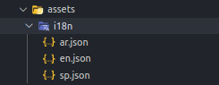
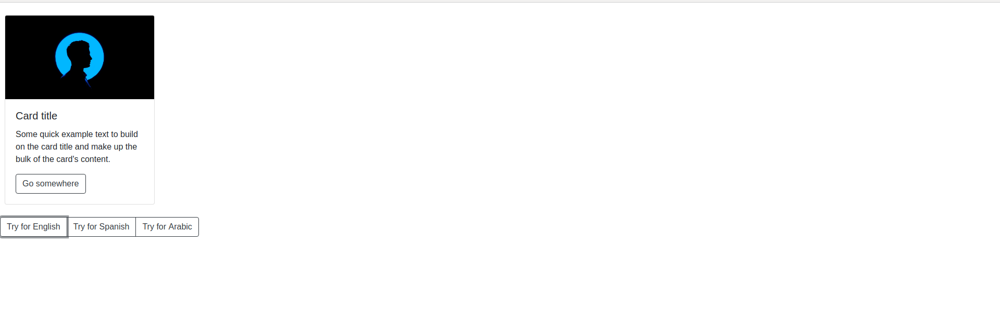
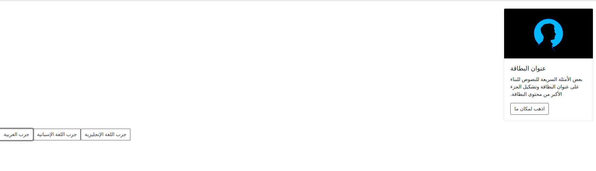
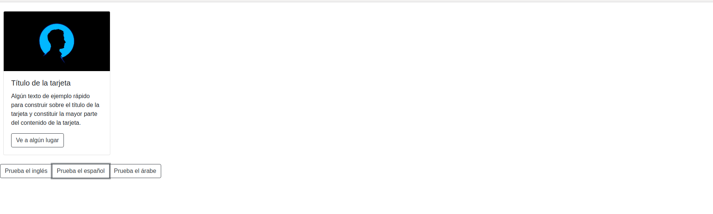

# Internationalization Example 

### 1 What Is Internationalization? 
 
  Internationalization is the process of making our app support various languages to extend the reach to a worldwide audience. Angular provides the `ngx-translate` module to give support of **Internationalization** to our application.
 
### 2 What Is Localization? 

  Localization is the process of translating the app to a particular language. 
  
### 3 Project Dependency 

#### 3.1 Important Dependency : 

 >"@ngx-translate/core" : "^13.0.0",\
 >"@ngx-translate/http-loader" : "^6.0.0",

To implement internationalization in our application we have to install these two modules given below.

```np
npm i @ngx-translate/core @ngx-translate/http-loader --save
```

#### 3.2 Extra Dependency :

>"bootstrap": "^5.0.1",

### 4 Steps To Implement Internationalization 

-  Create new `TranslateHttpLoader` instance
-  Provide TranslateHttpLoader instance to **TranslateModule**
-  Add different languages to **TranslateService**
-  Create json(ar.json,en.json,sp.json) files acording to languages
-  Implemnet **'rtl'** to **'ltr'** according to language selected
-  Create keys in json files and use `Translate` pipe to reder language specific text in html

#### 4.1 Create new TranslateHttpLoader instance

  We have created factory function to create new TranslateHttpLoader instance and provided HttpClient to that instance to request json file according to langugae (en -> en.json) : 
  
```js
  function TranslationLoaderFactory(http: HttpClient) {
    return new TranslateHttpLoader(http);
  }
```

#### 4.2 Provide TranslateHttpLoader instance to TranslateModule

Provide new instance of TranslateHttpLoader to the TranslateLoader using factory-function 'TranslationLoaderFactory' :
```js
  TranslateModule.forRoot({
      loader: {
        provide: TranslateLoader,
        useFactory: TranslationLoaderFactory,
        deps: [HttpClient]
      }
  })
```

#### 4.3 Add different languages to TranslateService

Add languge support to translationservice using `addLangs()` method and set any default langngue by using `setDefaultLang` :

```js
  translateService.addLangs(['en', 'ar', 'sp']);   //set array of languages
  translateService.setDefaultLang('en');    // set default language
  const browserLanguage = translateService.getBrowserLang();
  translateService.use(browserLanguage.match(/en|ar|sp/) ? browserLanguage : 'en');   
  //if browser language is not from our supported language then use english as laguage
```

#### 4.4 Create json files acording to languages

- For Arabic  => **ar.json**
- For English => **en.json**
- For Spanish => **sp.json**




#### 4.5 Implemnet **'rtl'** to **'ltr'** according to language selected

Add Attribute `dir` to html tag to change direction :
```js
  let htmlTag = this.document.getElementsByTagName('html')[0] as HTMLHtmlElement;
  htmlTag.dir = language === 'ar' ? 'rtl' : 'ltr'; 
  // change direction of rendering by`<html dir="rtl"> </html>`
```

#### 4.6 Create keys in JSON files and use `Translate` pipe to render language-specific text in Html

```js
  <div class="card-body">
      <h5 class="card-title">{{ 'card-title' | translate}}</h5>
      <p class="card-text">{{'card-detail' | translate}}</p>
      <a href="#" class="btn btn-outline-dark">{{'go-somewhere' | translate}}</a>
  </div>
```
en.json :
```json
    "card-title": "Card title"
```
ar.json :
```json
    "card-title":"عنوان البطاقة"
```
sp.json :
```json
    "card-title":"Título de la tarjeta"
```


### 5 Change Language 

#### 5.1 English Langugage : 



#### 5.2 Arabic Langugage : 



#### 5.3 Spanish Langugage : 


